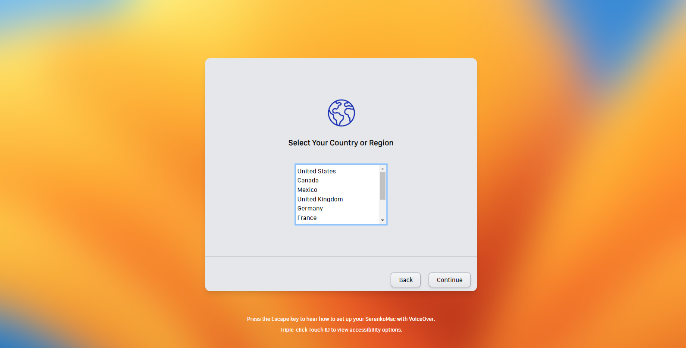

# Mac OS X Setup screen

This is my personal project, a copy of the country select screen using html and tailwind.

## Technologies Used

- HTML
- Tailwind CSS

## Preview




## Setup & Usage

1. Clone the repository:
   ```sh
   git clone https://github.com/seranok1337/Mac-OS-Setup-Tailwind.git
   ```
2. Navigate to the project folder:
   ```sh
   cd Mac-OS-Setup-Tailwind
   ```
3. Open `index.html` in your browser to view the UI.

## Customization

- **Fonts**: You can add custom `.otf` fonts by linking them in the style tag in index.html:
  ```css
  @font-face {
    font-family: 'YourFont';
    src: url('./fonts/your-font.otf') format('opentype');
  }
  ```
- **Colors & Styling**: Modify Tailwind classes directly in `index.html`.

## Preview

To see the UI in action, open the `index.html` file in a browser.

## License

This project is open-source and available under the MIT License.

